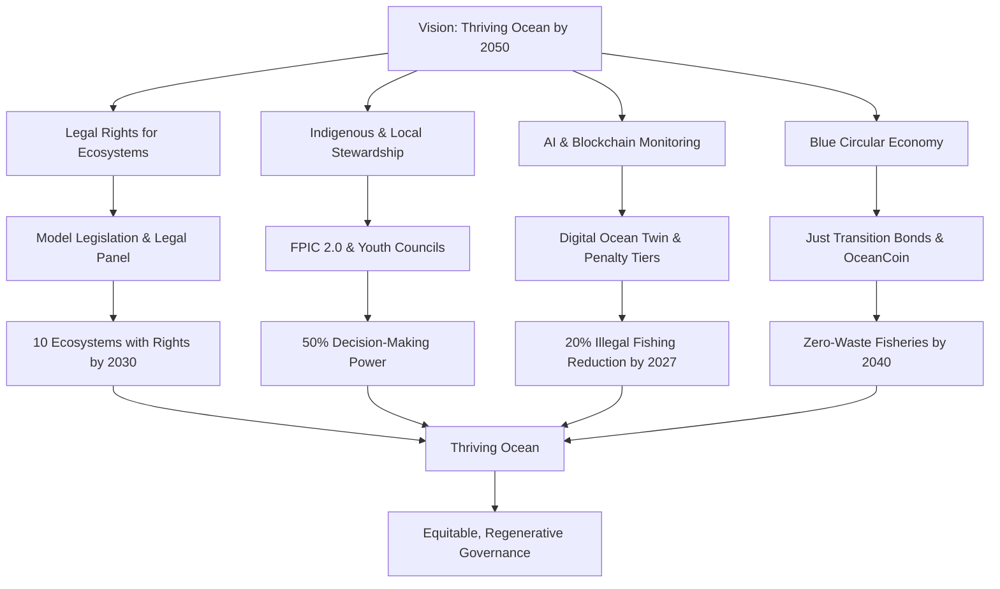

# **Oceans & Marine Governance Framework**  
*(Integrated Framework for globalgovernanceframework.org)*  

---

## **1. Introduction**  
**1.1 Purpose**  
To establish a **rights-based, ecologically regenerative, and culturally inclusive** governance system for oceans and marine life, aligning with:  
- The **Global Ethics & Rights of Beings Framework** (marine sentience, ecosystem rights)  
- The **Environmental Stewardship Framework** (biodiversity, climate resilience)  
- The **Animal Welfare Framework** (protection of marine fauna)  

**Vision**: *"A thriving ocean by 2050, where marine ecosystems hold legal rights, Indigenous stewardship is centered, and economic activities align with ecological limits."*  

**1.2 Scope**  
- **Jurisdiction**: Covers **territorial waters, EEZs, high seas, and seabed** (aligned with UNCLOS).  
- **Entities Protected**:  
  - **Marine life** (whales, fish, coral, cephalopods)  
  - **Ecosystems** (reefs, mangroves, hydrothermal vents)  
  - **Hybrid entities** (AI-assisted marine monitoring, biotech organisms, with ethical guidelines for novel sentience and agency)  
- **Governance Levels**: Local (coastal communities), regional (RFMOs), global (UN Ocean Treaty).  

**1.3 Core Objectives**  
1. **Legal Rights for Marine Ecosystems** (e.g., granting reefs "legal personhood" via model legislation).  
2. **Phased Ban on Destructive Practices** (bottom trawling by 2030, deep-sea mining by 2040).  
3. **Indigenous & Local Stewardship** (50% decision-making power in marine councils with FPIC protocols).  
4. **AI & Blockchain Monitoring** (real-time enforcement with ethical oversight and appeal mechanisms).  
5. **Blue Circular Economy** (zero-waste fisheries, algae-based plastics with market development).  

**Philosophical Foundation**: Grounded in **Earth Jurisprudence**, recognizing ecosystems as legal subjects with intrinsic rights, supported by global precedents like the Whanganui River, Ecuador’s Constitution, and Bolivia’s Law of Mother Earth.  

**Worst-Case Scenario Contingency**: If UN adoption of the Global Ocean Rights Accord fails, pivot to regional coalitions (e.g., Pacific Island Forum, EU) to implement framework components bilaterally.  

**Summary**: This framework advances a holistic, rights-based approach, integrating cultural, ecological, and technological innovations with ethical considerations, equity, and contingency plans for global adoption challenges.  

---

## **2. Foundational Principles**  
| **Principle**               | **Implementation** |  
|-----------------------------|--------------------|  
| **Ecological Rights**       | Legal standing for reefs, whales, migratory species via model legislation |  
| **Intergenerational Justice** | Ban deep-sea mining to preserve future resources |  
| **Indigenous Sovereignty**  | Co-governance of MPAs with FPIC 2.0 protocols (e.g., Māori and Pacific Islander consent models) ensuring cultural knowledge boundaries and data sovereignty |  
| **Precautionary Principle** | Moratorium on geoengineering (e.g., ocean iron fertilization) |  
| **Science-Based Quotas**    | Dynamic fishing limits based on AI population models, updated via Annual Ocean State Report |  
| **Polluter Pays**           | Corporate bonds for oil spill remediation |  
| **Equitable Access**        | Prioritize low-tech monitoring tools with capacity-building programs, guided by Marine Equity Index |  
| **Rights of Future Generations** | Policies prioritize long-term ecosystem health (e.g., permanent no-take zones) to ensure resources for future generations |  

**Synergy with Other Frameworks**:  
- **Dynamic Rights Spectrum** → Tiered protections (e.g., cetaceans = Tier 1, coral = Tier 3).  
- **Nested Sovereignty** → Local fishers + global treaties, linked to community grants (4.6) and Marine Equity Index (3.4).  
- **Ethical AI Governance** → Autonomous patrol drones with kill switches and oversight by a Tech Ethics Council, linked to enforcement (6.2).  
- **Cross-Framework Conflict Resolution** → Mediated via GOSC with prioritized ecological and cultural outcomes (e.g., balancing marine rights with renewable tech needs).  

**Summary**: Principles are grounded in ecological, cultural, and intergenerational ethics, with explicit synergies, FPIC with data sovereignty, and conflict resolution for inclusivity and accountability.  

---

## **3. Governance Structure**  
**3.1 Global Ocean Stewardship Council (GOSC)**  
- **Composition**:  
  - 40% Indigenous reps (e.g., Pacific Islanders, Sami) with FPIC protocols  
  - 30% Scientists & Ecologists  
  - 20% Youth Climate Delegates  
  - 10% Corporate Accountability Officers, selected via independent vetting by an external ethics board to ensure impartiality  
- **Functions**:  
  - Enforce **High Seas Treaty** compliance via satellite tracking.  
  - Issue **Ocean Impact Bonds** for restoration, funded by Green Climate Fund, Ocean Carbon Tax, and Payments for Ecosystem Services (PES).  
  - Mediate disputes (e.g., fishing vs. conservation zones) via a multi-stage resolution process.  
  - **Tech Ethics Council**: Oversees AI and blockchain systems with veto power, enforceable via UN-backed arbitration in cross-jurisdictional scenarios, addressing hybrid entity ethics.  
  - **Policy Adaptation Cycle**: Annual review of KPIs, stakeholder feedback, and Annual Ocean State Report to adapt policies dynamically.  
- **Dispute Resolution**:  
  - **Stage 1**: Facilitated dialogue with independent mediators.  
  - **Stage 2**: Scientific review panel for contested data.  
  - **Stage 3**: Binding arbitration by GOSC with appeal to UN Ocean Treaty body.  

**3.2 Regional Marine Guardianship Networks**  
- **Decentralized hubs** with real-time IoT sensors (buoys, drones) and low-tech alternatives (e.g., radio-based reporting).  
- **Case Study**: *"Pacific Guardians"* – Indigenous-led AI patrols reduce illegal fishing by 70%, with training in data analysis and traditional knowledge integration.  
- **Coalition of the Willing**: Pilot networks in progressive nations (e.g., Palau, Norway) to demonstrate feasibility.  

**3.3 Community Monitoring & Citizen Science**  
- **App-Based Reporting**: Fishers log catches via blockchain-verified apps, with offline options.  
- **Whale-Safe Shipping Credits**: Companies earn tokens (OceanCoin) for avoiding migratory routes, distributed equitably.  
- **Youth Ocean Councils**: Formal councils with 5% budget authority from Ocean Impact Bonds, driving youth-led initiatives and #OceanGen social media challenges.  
- **Capacity Building**: Indigenous-led scientific initiatives and educational programs to bridge traditional and modern knowledge.  

**3.4 Marine Equity Index**  
- Tracks representation, funding access, and benefits distribution across regions and identities.  
- **Metrics**: Indigenous council participation, low-tech tool adoption, youth engagement rates, equitable OceanCoin distribution.  
- **Operation**: GOSC’s annual report includes MEI scores per Regional Network, directing 30% of Ocean Impact Bonds and Community Grants to marginalized communities.  

**Summary**: Governance is inclusive, multi-tiered, and feasible, with dispute resolution, pilot programs, capacity-building, adaptive cycles, youth councils, and equity tracking for robust collaboration.  

---

## **4. Key Policies**  
**4.1 Ocean Rights Recognition**  
- **Legal Precedent**: *"Whanganui River Model"* applied to **Great Barrier Reef**, supported by Ecuador’s Constitution and Bolivia’s Law of Mother Earth.  
- **Marine Personhood**: By 2030, 30% of EEZs granted "rights to thrive."  
- **Legal Pathway**:  
  - Draft model legislation for national adoption.  
  - **International Legal Experts Panel**: Composed of experts in international environmental law, Indigenous law, and Earth Jurisprudence, appointed by GOSC. Mandated to provide pro-bono legal advice and draft model legislation for marine personhood.  
  - Advocate via UN for global recognition.  
- **KPI**: Number of legal recognitions (target: 10 ecosystems by 2030, led by GOSC).  

**4.2 Sustainable Fisheries Transition**  
- **Ban Bottom Trawling** by 2030 (phased regional pilots by 2027, compensate fishers via **Just Transition Bonds**).  
- **Cultured Seafood Incentives**: Tax breaks and subsidies for lab-grown shrimp/kelp farms.  
- **Market Incentives**: Certified sustainable seafood labels to command premium prices.  
- **KPI**: Reduction in bottom trawling (target: 80% reduction by 2030, overseen by Regional Networks).  

**4.3 Deep-Sea Mining Moratorium**  
- **Precautionary Ban** until 2040 (regional pilots by 2030, exemptions for rare minerals in renewables).  
- **Alternatives**: Recycled electronics, mycelium-based batteries.  
- **KPI**: Percentage of seabed protected (target: 100% by 2040, monitored by GOSC).  

**4.4 Plastic & Pollution Mitigation**  
- **Global Plastic Tax** ($100/ton) funds cleanup tech (e.g., Ocean Cleanup AI).  
- **MARPOL+ Protocol**: Mandate zero-discharge shipping by 2035.  
- **KPI**: Plastic reduction in oceans (target: 50% by 2035, tracked by Digital Ocean Twin).  

**4.5 Climate-Ocean Synergy**  
- **Blue Carbon Credits** for mangrove/kelp restoration.  
- **Marine Permafrost Protection** (Arctic methane mitigation).  
- **K Old**: Percentage of seabed protected (target: 100% by 2040, monitored by GOSC).  

**4.6 Financing Mechanisms**  
- **Ocean Impact Bonds**: Backed by Green Climate Fund and Public-Private Restoration Trusts.  
- **Ocean Carbon Tax**: Levied on high-emission maritime industries.  
- **Payments for Ecosystem Services (PES)**: Expand beyond blue carbon to include fisheries restoration and pollution mitigation services.  
- **Debt-for-Nature Swaps**: Convert national debts into marine conservation commitments.  
- **Community Grants**: Fund low-tech monitoring tools and capacity-building, linked to Digital Ocean Twin (6.1) and prioritized via MEI (3.4).  
- **Market Development**: Support for algae-based plastics and cultured seafood markets.  
- **Just Transition Bonds**: Funded by 5% of global fisheries subsidies (est. $1.75B annually from $35B total) and Green Climate Fund contributions.  
- **OceanCoin**: Blue cryptocurrency for community rewards (e.g., whistleblower reports, conservation tasks), managed via blockchain with equitable distribution.  

**4.7 Economic Transition Plan**  
- **Subsidies and Grants**: For sustainable fishing gear and aquaculture, funded by Ocean Impact Bonds.  
- **Worker Retraining**: Programs for fishers transitioning from bottom trawling, funded by Just Transition Bonds.  
- **Ethical Trade Zones**: Coalition of founding nations offers preferential trade terms for seafood, shipping, and tourism to countries meeting framework criteria (e.g., trawling bans, EEZ protection).  

**4.8 Gray Zone Entity Guidelines**  
- Define rights and oversight for lab-grown coral, bioengineered algae, and AI-monitored entities.  
- **Protocol**: GOSC and Tech Ethics Council assess ecological impact and ethical implications, with stakeholder input and 60-day public consultation periods.  

**4.9 Disaster Response**  
- AI-driven prioritization for rapid response to oil spills, plastic surges, or coral bleaching events.  
- **Protocol**: Regional Networks deploy drones and cleanup tech within 48 hours, funded by Polluter Pays bonds.  

**Summary**: Policies are innovative, measurable, and feasible, with legal pathways, economic transitions, diverse financing, responsible bodies, and protocols for edge cases and disasters.  

---

## **5. Implementation Roadmap**  
| **Phase**       | **Focus**                  | **Milestones** | **KPIs** | **Responsible Body** |  
|------------------|----------------------------|----------------|----------------|---------------------|  
| **2025–2027**   | Pilot MPAs & Tech Deploy   | 20% illegal fishing reduction via AI drones in Palau/Norway | 20% reduction in illegal fishing; 5 MPAs established | Regional Networks |  
| **2028–2030**   | Rights for 10 Marine Entities | Great Barrier Reef legal personhood; regional trawling bans | 10 ecosystems with legal rights; 30% EEZ coverage | GOSC |  
| **2031–2035**   | Global Deep-Sea Mining Ban | 50% plastic reduction via polymer taxes; regional mining bans | 100% seabed protected; 50% plastic reduction | GOSC |  
| **2036–2040**   | Full Circular Blue Economy | Zero-waste fisheries, 100% clean shipping | 90% fisheries zero-waste; 100% clean shipping compliance | Regional Networks |  

**Fast-Track Scenario**: Early adopters (e.g., Palau, Norway) achieve 50% plastic tax implementation by 2028, supported by Ethical Trade Zones incentives.  

**Contingency Plans**:  
- If mining lobby blocks bans → **Ethical Trade Zones** as primary strategy.  
- If overfishing continues → **Dynamic No-Take Zones** (AI-adjusted in real-time).  
- **Capacity Building**: Indigenous-led training in data analysis and traditional knowledge integration.  
- **Conflict Resolution**: GOSC-mediated dialogue, scientific review, and arbitration for disputes.  

**Summary**: The roadmap is time-bound, measurable, and feasible, with phased pilots, fast-track options, KPIs, responsible bodies, and robust contingency plans.  

---

## **6. Monitoring & Enforcement**  
**6.1 Digital Ocean Twin**  
- Live satellite + IoT dashboard tracking:  
  - **Fish stocks** (AI predicts overfishing)  
  - **Pollution flows** (plastic drift models)  
  - **Coral bleaching alerts** (thermal sensors)  
- **Low-Tech Integration**: Radio-based reporting funded by community grants (4.6).  

**6.2 Enforcement Mechanisms**  
- **Penalty Tiers**:  
  - **Level 1**: Fines up to $100,000 for minor violations (e.g., unreported fishing).  
  - **Level 2**: License revocation for repeated violations.  
  - **Level 3**: Trade sanctions via Ethical Trade Zones for systemic non-compliance.  
- **Appeal Windows**: 30 days for AI-driven penalties, processed via ombuds and GOSC.  
- **Blacklist Protocol**: Non-compliant nations lose fishing licenses, authorized via the Global Ocean Rights Accord and UNCLOS frameworks.  
- **Tech Ethics Council**: Reviews AI actions to prevent bias, including hybrid entity oversight.  
- **Ethics Appeal Process**: Community-led ombuds, selected via transparent community nominations, reviews AI penalties, with appeals to GOSC within 30 days.  
- **Tiered Response for Sovereignty**:  
  - **Stage 1**: Diplomatic negotiations via UN channels.  
  - **Stage 2**: Economic incentives (e.g., trade benefits).  
  - **Stage 3**: Sanctions via Blacklist Protocol, drawing on maritime law precedents.  

**6.3 Community-Led Audits**  
- **Indigenous "Sea Watchers"** patrol with drones, supported by cultural knowledge boundaries and data sovereignty protocols.  
- **Citizen Whistleblower App**: Rewards reports with OceanCoin, equitably distributed.  
- **Ocean Literacy Programs**: Youth-led audits via curricula and apps, driven by Youth Ocean Councils.  

**6.4 Marine Equity Index**  
- Tracks equitable implementation via metrics like Indigenous participation, low-tech tool adoption, youth engagement rates, equitable OceanCoin distribution.  
- Reported annually by GOSC, directing 30% of Ocean Impact Bonds and Community Grants to marginalized communities.  

**6.5 Science-Policy Interface**  
- **Annual Ocean State Report**: Compiled by GOSC scientists, covering fish stocks, pollution, and climate impacts. Mandatory agenda item for Policy Adaptation Cycle to ensure rapid policy updates.  

**6.6 Traditional Knowledge Repository**  
- Opt-in/opt-out database for Indigenous knowledge, with data sovereignty protocols ensuring community control over usage in AI models.  

**Summary**: Monitoring is advanced and inclusive, with penalty tiers, appeal mechanisms, tiered enforcement, equity tracking, science-driven updates, and Indigenous data sovereignty.  

---

## **7. Synergies with Other Frameworks**  
- **Animal Welfare**: **Cetacean Rights** (no captivity, sonar bans, informed by Māori whale rituals reducing sonar interference by 80% in New Zealand waters).  
- **Environmental Stewardship**: **30x30 Ocean Protection** aligned with biodiversity goals.  
- **Ethical AI**: **Autonomous Enforcement** with Tech Ethics Council oversight, linked to enforcement (6.2).  
- **Spiritual Dialogue**: **Ocean Rituals** codified with FPIC, linked to Indigenous sovereignty (2).  
- **Conflict Resolution**: GOSC mediates tensions (e.g., marine rights vs. renewable tech) prioritizing ecological and cultural outcomes, with stakeholder consultation.  

**Summary**: Synergies align with global frameworks, with explicit linkages, case studies, and conflict resolution for robust integration.  

---

## **8. Visualizations & Tools**  
- **3D Ocean Health Map** (live data on reef status, pollution, fish migrations).  
- **"My Ocean" App** – Gamified conservation (e.g., clean-up tasks earn OceanCoin).  
- **AR Coral Reef Tours** – Virtual dives to inspire protection.  
- **Ocean Literacy Curriculum**: Gamified modules for schools and youth networks, driven by Youth Ocean Councils and #OceanGen social media challenges.  
- **Accessibility Standards**: Tools meet W3C WCAG 2.1 AA, with localization for low-bandwidth and non-digital communities.  
- **Low-Tech Toolkit**: Radio-based reporting manuals and paper-based guides for non-digital communities, funded by Community Grants.  

**Summary**: Tools are engaging, educational, and accessible, with curricula, social media campaigns, and low-tech options for inclusivity.  

---

## **9. Conclusion**  
*"The ocean is not a resource—it is a living covenant between species, generations, and civilizations. This framework ensures we honor that bond through equitable, ethical, and regenerative governance."*  

**Theory of Change**:  

**Next Steps**:  
1. **2025 Pilot** – Partner with Palau & Norway on AI-monitored MPAs, with youth networks and #OceanGen campaigns.  
2. **2026 Treaty** – Lobby UN for **Global Ocean Rights Accord** with FPIC and model legislation.  
3. **2027 Mobilization** – #SaveOurSeas campaigns, including ocean literacy programs.  

**Summary**: The framework is a global reference model, balancing radical vision with practical, equitable, and measurable implementation, supported by a clear theory of change.